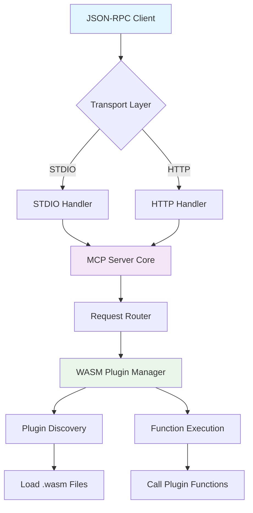
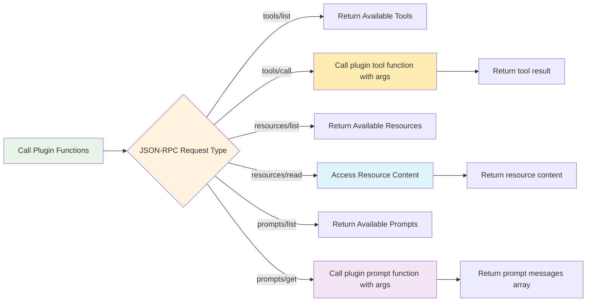

# Sea Flea MCP Server

**Sea Flea** is a MCP Server "WASM Runner"

Release `0.0.0`, 🐳 Docker image: `k33g/sea-flea:0.0.0`

## Overview

Sea Flea is an MCP (Model Context Protocol) server that supports WebAssembly (WASM) plugins. Plugins can provide three types of capabilities:

- **Tools**: Functions that can be called with arguments
- **Resources**: Static content accessible via URIs  (dynamic content is not yet implemented)
- **Prompts**: Templates for generating conversation prompts

And **Sea Flea** will load the plugin(s) and provide the JSON RPC endpoints.

> Available transports:
> - STDIO
> - Streamable HTTP
> WASM Runtime: [Extism](https://extism.org/) with the [Go SDK](https://github.com/extism/go-sdk) 

## Key Components:

**1. Transport Layer**
- Handles both STDIO and HTTP transports
- Routes requests to the main request router

**2. JSON-RPC Method Routing**
- Routes different JSON-RPC methods to appropriate handlers
- Supports MCP protocol methods: initialize, tools/*, resources/*, prompts/*

**3. WASM Plugin Loading Phase**
- Scans for `.wasm` files in the plugins directory
- Checks for exported functions: `tools_information`, `resources_information`, `prompts_information`
- Registers capabilities with the MCP server

**4. WASM Function Calls**
- **Tools**: Calls plugin functions like `add`, `hello`, `orc_greetings`, `roll_dices`
- **Resources**: Returns static content or calls dynamic handlers
- **Prompts**: Calls prompt functions like `request_information_prompt`, `roll_dices_prompt`

## Method Mapping:

| JSON-RPC Method | WASM Plugin Function Called |
|----------------|----------------------------|
| `tools/list` | `tools_information()` (during loading) |
| `tools/call` | `{tool_name}()` (e.g., `add`, `hello`) |
| `resources/list` | `resources_information()` (during loading) |
| `resources/read` | Static content or dynamic handler |
| `prompts/list` | `prompts_information()` (during loading) |
| `prompts/get` | `{prompt_name}()` (e.g., `roll_dices_prompt`) |

The system follows a plugin discovery pattern where WASM plugins expose their capabilities through information functions, and then the runtime calls the actual implementation functions based on JSON-RPC requests.

## 1. High-Level Architecture Overview

## 2. WASM Plugin Function Calls by JSON-RPC Request

